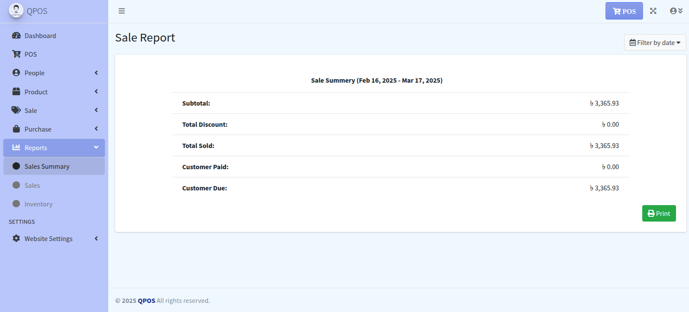

<p align="center">
<a href="https://qtecsolution.com/" target="_blank">

</a>
</p>

# 🚀 POS system in Laravel & React  

<div style="display: flex;">
    
    
    
    
    
</div>

<br>

Our POS system streamlines sales and inventory management. It features a **Dashboard** for key metrics, **POS** for easy transactions, and **Customer & Supplier Management** for tracking. **Product Management** allows bulk imports and organization. **Sale & Purchase Management** tracks transactions, while **Reports** provide business insights. **Inventory Management** includes low-stock alerts, and **Discount & Pricing Control** enables flexible pricing. **User Roles & Permissions** control access, and **Settings** customize preferences. Efficient, reliable, and ready to scale your business. 🚀

## ✨ Features  


 ### 📊 Dashboard
 - Provides an overview of sales, and key metrics and some chart.
### 🛒 POS (Point of Sale) 
-  Handles sales transactions with product search by name or barcode.
### 👥 Customer Management 
-  Manage customer details for tracking purchases.
### 🏢 Supplier Management 
-  Store supplier details for inventory management.
### 📦 Product Management 
-  Add, edit, and organize products, including categories, brands, and units.
### 📂 Product Import 
-  Bulk import products using CSV or other formats.
### 💵 Sale Management 
-  View and track all sales transactions.
### 🛍️ Purchase Management 
-  Manage purchases and supplier orders.
### 📊 Reports 
- Generate reports for sales, inventory, and overall business performance.
### 📉 Inventory Management 
-  Track stock levels and get alerts for low stock.
### 💲 Discount & Pricing Control 
-  Apply discounts and manage special pricing.
### 🔒 User Roles & Permissions 
-  Assign roles and restrict access to certain functionalities.
### ⚙️ Settings 
- Configure system preferences, tax rates, and other business settings.

  
## 🎥 Demo
You can browse the live demo of the POS system in Laravel & React at the following link:

[](https://qpos.qtecsolution.com/login/)

### Dashboard:


### POS :


### Sales List :


### Product Add :


### Product List :


### Product Purchase :


 ### Reporting :




### Users & Role Management :


 ### Application Settings :


## 📦 Installation

Welcome to the setup guide for the **POS system in Laravel & React**. This document provides comprehensive steps to install, configure, and run the project in your local environment, using both Docker and a native setup. Follow these instructions to ensure proper configuration.

## 📝 Prerequisites

Please ensure you have the following installed on your system:

- **PHP** (version 8.2 or higher)
- **Composer**
- **npm**
- **MySQL** (version 8.0 or compatible, e.g., MariaDB)
- **Git**
- **XAMPP** or **WAMP** (optional, for an all-in-one local server environment)

## 📈 Server Requirements

This application requires a server with the following specifications:

- **PHP** (version 8.2 or higher) with the extensions:
    - BCMath
    - Ctype
    - Fileinfo
    - JSON
    - Mbstring
    - PDO
    - GD
    - Zip
    - PDO MySQL
- **MySQL** (version 8.0) or **MariaDB**
- **Composer**
- **Nodejs**
- **Web Server**: Apache or Nginx


## ⚙️ Setup Options

This guide covers two setup methods:
1. **Setting Up Locally (Without Docker)**
2. **Using Docker**

### 🚀 Setup Without Docker

#### 1. Clone the Repository

```bash
git clone https://github.com/qtecsolution/qpos.git
```

```bash
cd qpos
```

#### 2. Install Dependencies

Within the project directory, run:
####  PHP Dependencies
```bash
composer install
```
#### Node Dependencies

```bash
npm install
```

#### 3. Configure the Environment

Create the `.env` file by copying the sample configuration:

```bash
cp .env.example .env
```

#### 4. Generate Application Key

Secure the application by generating a key:

```bash
php artisan key:generate
```

#### 5. Configure Database

You can configure the database using either the MySQL client or phpMyAdmin.

**Using MySQL Client:**

1. **Access MySQL**:

    ```bash
    mysql -u {username} -p
    ```

2. **Create Database**:

    ```sql
    CREATE DATABASE {db_name};
    ```

3. **Grant User Permissions**:

    ```sql
    GRANT ALL ON {db_name}.* TO '{your_username}'@'localhost' IDENTIFIED BY '{your_password}';
    ```

4. **Apply Changes and Exit**:

    ```sql
    FLUSH PRIVILEGES;
    EXIT;
    ```

5. **Update `.env` Database Settings**:

    ```plaintext
    DB_CONNECTION=mysql
    DB_HOST=127.0.0.1
    DB_PORT=3306
    DB_DATABASE={db_name}
    DB_USERNAME={your_username}
    DB_PASSWORD={your_password}
    ```

**Using phpMyAdmin:**

1. **Access phpMyAdmin** and log in with your credentials.

2. **Create Database**:
    - Go to the "Databases" tab.
    - Enter `{db_name}` in the "Create database" field.
    - Click "Create".
    3. **Create User and Grant Permissions (If Needed)**:
        - You can either use the root user or create a new user.
        - To create a new user, go to the "User accounts" tab.
        - Click "Add user account".
        - Fill in the "User name" and "Password" fields.
        - Under "Database for user", select "Create database with same name and grant all privileges".
        - Click "Go".

4. **Update `.env` Database Settings**:

    ```plaintext
    DB_CONNECTION=mysql
    DB_HOST=127.0.0.1
    DB_PORT=3306
    DB_DATABASE={db_name}
    DB_USERNAME={your_username}
    DB_PASSWORD={your_password}
    ```

#### 6. Run Migrations and Seed Data

To set up the database tables and populate them with initial data, run:

```bash
php artisan migrate --seed
```

#### 7. Start the Development Server

To run the application locally, execute:

```bash
php artisan serve
npm run dev
```

Your application will be available at [http://127.0.0.1:8000](http://127.0.0.1:8000).

### 🐳 Setup with Docker

#### 1. Clone the Repository

```bash
git clone https://github.com/qtecsolution/qpos.git
cd qpos
```

#### 2. Initialize the Project with `Make` Command

- **Setup Project**

```bash
make setup
```

Access the application at [http://localhost](http://localhost).


## 🛠️ Additional Information

- **Seeding**: The database seeder is configured to populate initial data. Run `php artisan migrate --seed` to use it. After running the seeder, you can log in as an admin using the following credentials:
    - **Email**: demo@qtecsolution.net
    - **Password**: 87654321
- **Environment Variables**: Ensure all necessary environment variables are set in the `.env` file.
- **Database Configuration**: The application is configured for MySQL by default. Update the `.env` file as needed for other database connections.

## 🤝 Contributing

This is an open source project and contributions are welcome. If you are interested in contributing, please follow this steps:

1. **Fork the Repository**:

   - Fork the project on GitHub.

2. **Create a Branch**:

   - Create a new branch for your feature or bug fix.

   ```bash
   git checkout -b feature/your-feature-name

   ```

3. **Submit a Pull Request**:

   - Open a pull request from your branch to the main repository. Provide a detailed description of your changes.

   <b>Our Team will review and merge your request</b>

## 📝 License

The POS system in Laravel & React project is open source and available under the MIT License. You are free to use, modify, and distribute this codebase in accordance with the terms of the license.

Please refer to the LICENSE file for more details.

## Support

If you encounter any issues or have questions, feel free to reach out through the following channels:

- Open an issue on the [GitHub repository](https://github.com/qtecsolution/qpos).
- **Call for Queries**: +8801313522828 (WhatsApp)
- **Contact Form**: [Qtec Solution Contact Page](https://qtecsolution.com/contact-us)
- **Email**: [info@qtecsolution.com](mailto:info@qtecsolution.com)


## Follow Us on Social Media

Stay updated with the latest news, updates, and releases:

 <br>
[](https://qtecsolution.com/Qtec-Solution-Limited-Portfolio.pdf)
[](https://www.facebook.com/QtecSolution/)
[](https://www.instagram.com/qtecsolution/)
[](https://www.linkedin.com/company/qtec-solution)
[](https://twitter.com/qtec_solution)
[](https://www.youtube.com/@qtecsolutionlimited)
[](https://qtecsolution.com/)
